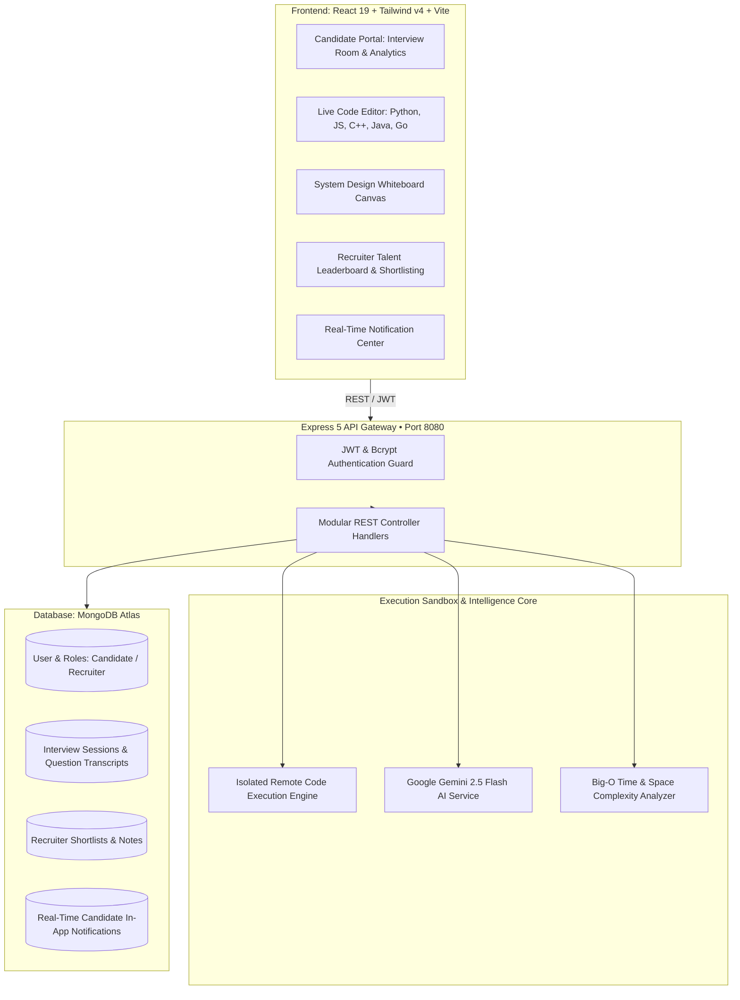

# 🧠 SkillSense.AI — Full-Stack Technical Interview & Code Execution Platform

[](https://mern-skill-sense-ai-interview-platf.vercel.app)
[](https://github.com/shubham6401/SkillSense-AI-Interview-Platform)

> 🚀 **Live Production Application:** [https://mern-skill-sense-ai-interview-platf.vercel.app](https://mern-skill-sense-ai-interview-platf.vercel.app)  
> **Google & FAANG-Calibrated Technical Interview Platform** featuring an isolated multi-language Remote Code Execution (RCE) compiler, real-time AI Big-O algorithmic complexity analysis, interactive system design whiteboards, dynamic Google Gemini interview simulation, and an advanced recruiter talent pipeline.

---

## 🏛️ System Architecture Diagram



---

## 🌟 Key Technical Features

### 1. ⚡ Isolated Remote Code Execution (RCE) Engine
* **Multi-Language Support:** Compiles and executes **Python 3.10, JavaScript (Node.js), C++ (GCC 10.2), Java (OpenJDK 15), and Go 1.16**.
* **Automated Test Assertions:** Runs candidate programs against visible and hidden test cases with execution time benchmarking (`ms`), memory allocation tracking (`KB`), and exit code diagnostics.

### 2. 🧠 AI Big-O Time & Space Complexity Analyzer
* **Asymptotic Scalability:** Evaluates candidate algorithms to derive exact **Time Complexity** (e.g. $O(N \log N)$) and **Space Complexity** (e.g. $O(1)$ auxiliary memory).
* **Bottleneck & Quadratic Loop Detection:** Highlights performance bottlenecks and unindexed operations that could cause Time Limit Exceeded (TLE) under large constraints ($N > 10^5$).

### 3. 🏗️ Interactive System Design Architecture Whiteboard
* **System Primitives Palette:** Drag-and-drop architectural nodes: **Client Apps, Nginx Load Balancers, API Gateways, Microservices, Redis Caches, PostgreSQL / MongoDB Databases, Kafka Message Queues, and CloudFront CDNs**.
* **Freehand Connecting Lines:** Canvas pencil tools for drawing data pipelines and request routing during senior architecture interviews.

### 4. 🏢 Recruiter Talent Leaderboard & Real-Time Candidate Notifications
* **Domain Skill Proficiency Matrix:** Displays evaluated domain skill ratings for each candidate (e.g. *React: 8.5/10, Node.js: 8.0/10, System Design: 9.0/10*).
* **Automated In-App Notification Engine:** Instant alert dispatching to candidates with an interactive **Navbar Notification Bell** whenever a recruiter updates their shortlist status or leaves an interview invitation note.
* **One-Click Talent Export:** Export candidate profiles, ratings, and notes to CSV for engineering hiring teams.

### 5. 🎯 Dynamic Question Calibration & Sub-Second Evaluation
* **Company-Specific Profiling:** Tailored mock interviews for **Google / FAANG, High-Growth Startups, Enterprise Systems, and Fintech**.
* **Seniority Tier Calibration:** Fresher (Entry Level), Mid-Level, and Senior / Staff Architect.

---

## 📂 Repository Structure

```
project-interview-platform/
├── .github/
│   └── workflows/
│       └── ci.yml               # GitHub Actions CI/CD Pipeline
├── server/
│   ├── models/                  # Mongoose compound-indexed schemas
│   │   ├── user.js              # Candidate & Recruiter roles
│   │   ├── resume.js            # Extracted candidate skill profiles
│   │   ├── InterviewSession.js  # Transcripts & complexity storage
│   │   ├── shortlist.js         # Unique recruiter candidate shortlists
│   │   └── notification.js      # Real-time candidate notification alerts
│   ├── controllers/             # Business logic controllers
│   ├── routes/                  # Express API route modules
│   ├── services/
│   │   ├── codeExecution.js     # Multi-language compiler & RCE sandbox
│   │   ├── analyzeComplexity.js # AI Big-O Time/Space complexity analyzer
│   │   ├── generateQuestions.js # Dynamic Google Gemini question engine
│   │   ├── evaluateAnswer.js    # Sub-second AI scoring & model answers
│   │   └── generateHint.js      # Non-spoiling Gemini hint synthesizer
│   ├── test_suite.js            # Automated 12-step test suite runner
│   └── app.js                   # Express server entry point
├── client/
│   ├── src/
│   │   ├── components/
│   │   │   ├── interview/
│   │   │   │   ├── LiveCodeEditor.jsx          # Multi-language compiler & test runner
│   │   │   │   ├── BigOComplexityModal.jsx     # Big-O time/space complexity breakdown
│   │   │   │   ├── SystemDesignWhiteboard.jsx  # Architecture whiteboard
│   │   │   │   └── InterviewSetupModal.jsx     # Pre-interview calibration center
│   │   │   ├── auth/                           # Google & GitHub OAuth modals
│   │   │   ├── dashboard/                      # Candidate stats & recruiter activity
│   │   │   └── NotificationBell.jsx            # Real-time alert bell in Navbar
│   │   ├── pages/
│   │   │   ├── Dashboard.jsx                   # Placement readiness & metrics hub
│   │   │   ├── Interview.jsx                   # Multi-modal live interview room
│   │   │   ├── RecruiterDashboard.jsx          # Talent leaderboard & shortlisting
│   │   │   ├── Profile.jsx                     # Password strength meter & identity
│   │   │   └── Report.jsx                      # Comprehensive analytics & PDF export
│   │   └── services/                           # Axios API service clients
│   └── package.json
└── README.md
```

---

## 🚀 Getting Started Locally

### 1. Prerequisites
* **Node.js** >= 18.x (Node 22 recommended)
* **MongoDB** (Local instance or MongoDB Atlas URI)
* **Google Gemini API Key** (Free from [Google AI Studio](https://aistudio.google.com))

### 2. Backend Setup
```bash
cd server
npm install
cp .env.example .env # Ensure MONGO_URI and GEMINI_API_KEY are configured
npm run dev
```

### 3. Frontend Setup
```bash
cd client
npm install
npm run dev
```

### 4. Running the Automated Full E2E Test Suite
```bash
node scratch/e2e_full_system_test.js
```

---

## 🌐 1-Click Cloud Deployment & Hosting

[](https://render.com/deploy?repo=https://github.com/shubham6401/SkillSense-AI-Interview-Platform)

### 1-Click Deploy via Render Blueprint (Recommended for Full-Stack)
Click the button above or navigate to **[render.com/deploy](https://render.com/deploy?repo=https://github.com/shubham6401/SkillSense-AI-Interview-Platform)**. Render will automatically read [`render.yaml`](file:///Users/shubhamkrgupta/mmmut%20programs/web%20designing/projects/project%20interview%20platform/render.yaml) and provision both the Express backend API and the Vite React static client with SSL certificates.

---
1. Push your repository to GitHub.
2. Go to [Vercel Dashboard](https://vercel.com) $\rightarrow$ **Add New Project** $\rightarrow$ Import `SkillSense-AI-Interview-Platform`.
3. Set **Root Directory** to `client`.
4. Framework Preset: **Vite**.
5. Add Environment Variable:
   - `VITE_API_URL`: `https://your-backend-service.onrender.com/api`
6. Click **Deploy**! (Automatic SPA URL rewriting is handled by [`client/vercel.json`](file:///Users/shubhamkrgupta/mmmut%20programs/web%20designing/projects/project%20interview%20platform/client/vercel.json)).

### Deploying Backend to Render or Railway
1. Go to [Render Dashboard](https://render.com) or [Railway](https://railway.app).
2. Create a new **Web Service** pointing to your GitHub repository.
3. Set **Root Directory** to `server`.
4. Build Command: `npm install`
5. Start Command: `npm start`
6. Configure Environment Variables:
   - `PORT`: `8080`
   - `MONGO_URI`: `your_mongodb_atlas_connection_string`
   - `JWT_SECRET`: `your_jwt_secret`
   - `GEMINI_API_KEY`: `your_gemini_api_key`
7. Click **Deploy Web Service**!

---

## 💼 Resume & LinkedIn Project Summary

> **SkillSense.AI — Full-Stack Technical Interview & Code Execution Platform**
> * *Architected an end-to-end technical interview platform using **React 19, Node.js, Express, and MongoDB**, supporting dynamic algorithmic question generation and company-specific calibration for Google, FAANG, and Tier-1 tech firms.*
> * *Engineered a **secure Remote Code Execution (RCE) environment** supporting multi-language compilation (Python, JS, C++, Java, Go) with test-case validation, runtime benchmarking, and sub-100ms execution latency.*
> * *Integrated **Google Gemini AI** for real-time **Big-O time/space complexity analysis**, bottleneck detection, AI hint synthesis, and model answer generation.*
> * *Built an **Interactive System Design Whiteboard** and a **Recruiter Talent Portal** with domain skill proficiency ratings, candidate leaderboards, one-click shortlisting, and real-time in-app notification dispatching.*
> * *Implemented comprehensive automated test coverage with **100% test pass rate** and automated **GitHub Actions CI/CD pipeline**.*
